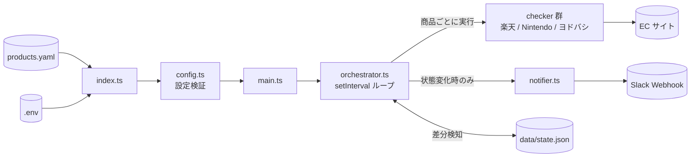

# stock-alert

在庫状況を定期的にポーリングし、変化があったときだけ Slack へ通知する**差分検知型の在庫監視ツール**です。

複数の商品・複数のサイトを一括で監視できます。初回チェックはベースラインの記録のみで通知せず、2 回目以降に「在庫あり → 在庫なし」「在庫なし → 在庫あり」の変化が検出されたときのみ通知します。

## 対応サイト

| サイト | 取得手法 |
|---|---|
| 楽天ブックス | 楽天 Books REST API |
| マイニンテンドーストア | Playwright (headless Chromium) |
| ヨドバシドットコム | fetch + cheerio（失敗時は Playwright にフォールバック） |

## クイックスタート

### 前提

- Node.js 22 以降（`--strip-types` 対応）+ pnpm、または Docker

### 1. インストール

```bash
pnpm install
pnpm exec playwright install chromium  # Nintendo / ヨドバシ チェッカー用
```

### 2. 環境変数の設定

```bash
cp .env.example .env
```

`.env` を編集します。

| 変数名 | 必須 | 説明 |
|---|---|---|
| `SLACK_WEBHOOK_URL` | ✅ | Slack Incoming Webhook の URL |
| `RAKUTEN_APP_ID` | ✅ | 楽天 API のアプリケーション ID |
| `CHECK_INTERVAL_SECONDS` | — | チェック間隔（秒、デフォルト: `300`） |

### 3. 監視商品の設定

`products.yaml` を編集します。

```yaml
products:
  - name: 商品名
    url: https://books.rakuten.co.jp/rb/4088843819/
    siteType: rakuten

  - name: 商品名
    url: https://www.yodobashi.com/product/100000001007954538/
    siteType: yodobashi

  - name: 商品名
    url: https://store.nintendo.co.jp/item/HAC-S-KAAAA.html
    siteType: nintendo
```

### 4. 起動

```bash
# ローカル
pnpm start

# Docker Compose
docker compose up --build
```

起動後、コンソールに `ready` と表示されれば成功です。最初のチェックは `CHECK_INTERVAL_SECONDS` 秒後に実行されます。

## アーキテクチャ概要



## 開発

```bash
# 型チェック
pnpm typecheck

# テスト
pnpm test
```

## ドキュメント

- [アーキテクチャ](docs/architecture.md) — モジュール構成・処理シーケンス・状態遷移・設計判断
- [在庫チェッカー](docs/checkers.md) — サイト別の実装詳細・新サイト追加手順
- [設定リファレンス](docs/configuration.md) — `products.yaml` と `.env` の全オプション
- [運用ガイド](docs/operations.md) — 起動方法・ログ・タイムアウト・既知の制約
