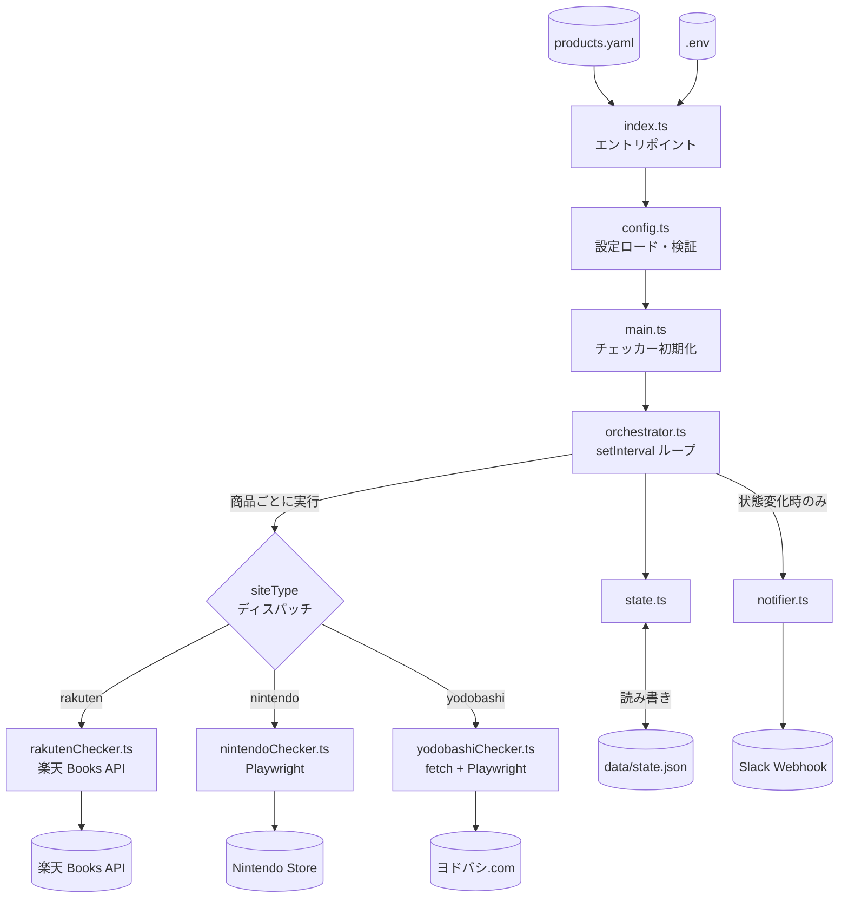
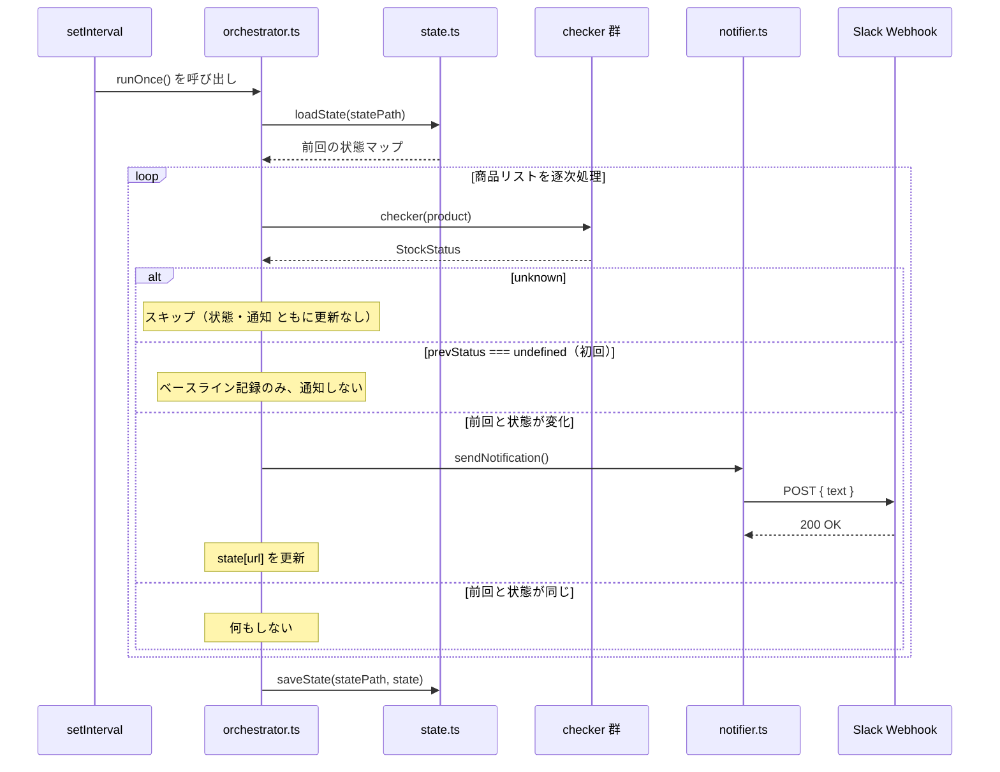
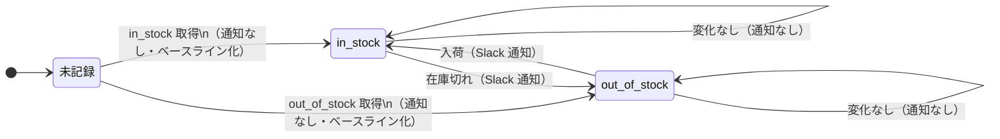

# アーキテクチャ

## 概要

stock-alert は、複数の EC サイトの在庫状況を定期的にポーリングし、変化があった場合だけ Slack へ通知する**差分検知型の常駐プロセス**です。

設計目標:

- **軽量** — 外部データベース不要。状態は JSON ファイル 1 本で永続化
- **拡張性** — 新サイトを追加するときは checker 1 ファイルと数行のディスパッチ追加のみ
- **無ビルド** — Node の `--strip-types` で TypeScript を直接実行。コンパイル成果物を持たない

---

## モジュール構成図



---

## モジュール責務表

| ファイル | 責務 |
|---|---|
| `src/index.ts` | `products.yaml` の読み込み、`loadConfig` の呼び出し、設定エラー時の `process.exit(1)` |
| `src/config.ts` | YAML と環境変数を valibot で検証し、型安全な `Config` オブジェクトを返す |
| `src/checker.ts` | 共通型 `StockStatus` / `Checker` の定義のみ（ロジックなし） |
| `src/main.ts` | 各サイトの checker を初期化し、`siteType` で振り分けるディスパッチャを `orchestrator` に渡す |
| `src/orchestrator.ts` | `setInterval` で `runOnce` を定期実行。差分検知と通知のオーケストレーション |
| `src/state.ts` | `data/state.json` の読み書き。ファイル不在時は空オブジェクトを返す |
| `src/notifier.ts` | Slack Incoming Webhook への POST。非 2xx で `NotifierError` をスロー |
| `src/rakutenChecker.ts` | 楽天 Books API で在庫確認（`availability === '1'` で在庫あり） |
| `src/nintendoChecker.ts` | Playwright でページを取得し、カートボタンの `disabled` 属性で在庫判定 |
| `src/yodobashiChecker.ts` | fetch + cheerio を一次手段とし、`unknown` 時のみ Playwright にフォールバック |

---

## 1 ティックの処理シーケンス

`setInterval` の 1 発火で起こる処理の流れです。



> **注意**: `startOrchestrator` は `setInterval` のみで起動するため、最初のチェックは `CHECK_INTERVAL_SECONDS` 秒後に実行されます（即時実行は行いません）。

---

## 在庫状態の遷移

商品 URL ごとに `data/state.json` で状態を管理します。`unknown` は常にスキップされ、状態として記録されません。



---

## 設計判断ノート

### 関数型ファクトリパターン

`Checker` は `(product: Product) => Promise<StockStatus>` という関数型で定義されています。各サイトの実装は `create<Site>Checker(...)` というファクトリ関数で、API キーなどの依存をクロージャに束ねて `Checker` を返します。クラス継承ではないため、テストでのモック差し替えが容易です。

```ts
// src/checker.ts
export type Checker = (product: Product) => Promise<StockStatus>

// src/rakutenChecker.ts
export function createRakutenChecker(appId: string): Checker {
  return async (product) => { /* appId はクロージャで束縛 */ }
}
```

### 逐次実行（並列化なし）

`runOnce` の商品ループは `for...of` で逐次実行します。`Promise.all` による並列化を避けているのは、Playwright（Nintendo / Yodobashi フォールバック）を同時起動するとリソース消費が急増するためです。商品数が増えた場合は `CHECK_INTERVAL_SECONDS` を伸ばすか、並列化を再検討してください。

### JSON ファイルによる状態永続化

状態は `data/state.json` に `Record<url, StockStatus>` 形式で保存します。SQLite/Redis を使わないことで依存関係を最小限に保っています。ただし複数プロセスの同時書き込みは未考慮のため、単一プロセスでの運用が前提です。

### Node `--strip-types` による無ビルド実行

TypeScript ファイルを `node --strip-types` で直接実行します。`tsc` は型チェック専用（`noEmit: true`）で、コンパイル成果物は生成しません。これにより開発・本番ともに同じソースファイルを使えます（Node 22 以降が必要です）。
