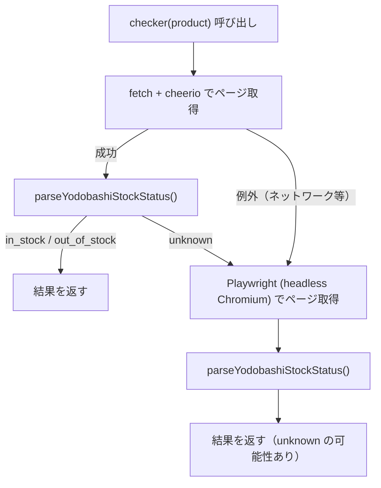

# 在庫チェッカー

## 共通契約

全チェッカーは `src/checker.ts` で定義された `Checker` 型に従います。

```ts
export type StockStatus = 'in_stock' | 'out_of_stock' | 'unknown'
export type Checker = (product: Product) => Promise<StockStatus>
```

**重要な責務分担**: 各チェッカーは例外を外にスローしません。ネットワーク障害・パース失敗・タイムアウトはすべて内部で catch し、`'unknown'` を返します。`orchestrator.ts` は `unknown` をスキップするため、失敗した商品は次のティックで自動的に再試行されます。

---

## サイト別実装比較

| サイト | ファイル | 取得手法 | 入力の加工 | 在庫判定キー | フォールバック |
|---|---|---|---|---|---|
| 楽天ブックス | `rakutenChecker.ts` | 楽天 Books REST API | URL から ISBN 抽出 (`/rb/(\d+)/`) | `availability === '1'` | なし（失敗 → `unknown`） |
| マイニンテンドーストア | `nintendoChecker.ts` | Playwright (headless Chromium) | URL をそのまま使用 | カートボタンの `disabled` 属性 | なし（失敗 → `unknown`） |
| ヨドバシドットコム | `yodobashiChecker.ts` | fetch + cheerio | URL から商品コード抽出 (`/product/(\d+)`) | `#salesInfoTxt` のテキスト | `unknown` のとき Playwright |

---

## 楽天ブックス

**ファイル**: `src/rakutenChecker.ts`

楽天 Books API (`BooksBook/Search/20130522`) に JSON でクエリを投げます。URL の `/rb/(\d+)/` パターンから ISBN を抽出し、`applicationId`（環境変数 `RAKUTEN_APP_ID`）とともにリクエストします。

```
URL 例: https://item.rakuten.co.jp/rakutenbooks/rb/4088843819/
            → ISBN: 4088843819
```

レスポンスは valibot でスキーマ検証し、`Items[0].Item.availability` が `'1'` なら在庫あり、それ以外は在庫なしと判定します。

**在庫判定ロジック**:

```
availability === '1'  → in_stock
availability !== '1'  → out_of_stock
取得/パース失敗        → unknown
```

---

## マイニンテンドーストア

**ファイル**: `src/nintendoChecker.ts`

Nintendo Store は JavaScript でページを動的に生成するため、fetch では在庫情報を取得できません。Playwright で headless Chromium を起動し、DOM が安定するまで 5 秒待機してからページ HTML を取得します。

**在庫判定ロジック**:

カートに追加ボタン（`id="ProductDetailSuper_AddCartButton_AddCartButton"`）の存在と `disabled` 属性を正規表現で検査します。

```
ボタンが見つかり、disabled なし  → in_stock
ボタンが見つかり、disabled あり  → out_of_stock
ボタンが見つからない             → unknown
```

**タイムアウト**:

- `page.goto` のタイムアウト: 30 秒
- JS 描画待機: 5 秒

---

## ヨドバシドットコム

**ファイル**: `src/yodobashiChecker.ts`

2 段構えの取得戦略を採用しています。Playwright より軽量な `fetch + cheerio` を優先し、在庫情報が取れない場合（`unknown` 返却 or 例外）のみ Playwright にフォールバックします。



**在庫判定ロジック** (`parseYodobashiStockStatus`):

```
#salesInfoTxt のテキストが「在庫あり」   → in_stock
#salesInfoTxt のテキストが空でない       → out_of_stock
.salesInfo p のテキストが空でない        → out_of_stock
いずれも条件に該当しない                 → unknown
```

**タイムアウト** (Playwright フォールバック時):

- `page.goto` のタイムアウト: 30 秒
- JS 描画待機: 3 秒

---

## 新サイト追加チェックリスト

1. **`src/<site>Checker.ts` を作成**
   - `create<Site>Checker(...)` ファクトリ関数を実装し `Checker` 型を返す
   - 例外は内部で catch して `'unknown'` を返す

2. **`src/config.ts` の `SiteTypeSchema` に追加**
   ```ts
   const SiteTypeSchema = v.picklist(['rakuten', 'yodobashi', 'nintendo', '<site>'])
   ```

3. **`src/main.ts` のディスパッチに分岐追加**
   ```ts
   if (product.siteType === '<site>') return <site>Checker(product)
   ```

4. **`tests/<site>Checker.test.ts` を作成**
   - HTML パース関数（`parse<Site>StockStatus`）をエクスポートしてユニットテスト
   - 外部通信（fetch / Playwright）は vi.mock でモック

5. **`products.yaml` にサンプルエントリを追記**
   ```yaml
   - name: 商品名
     url: https://example.com/product/xxx
     siteType: <site>
   ```
