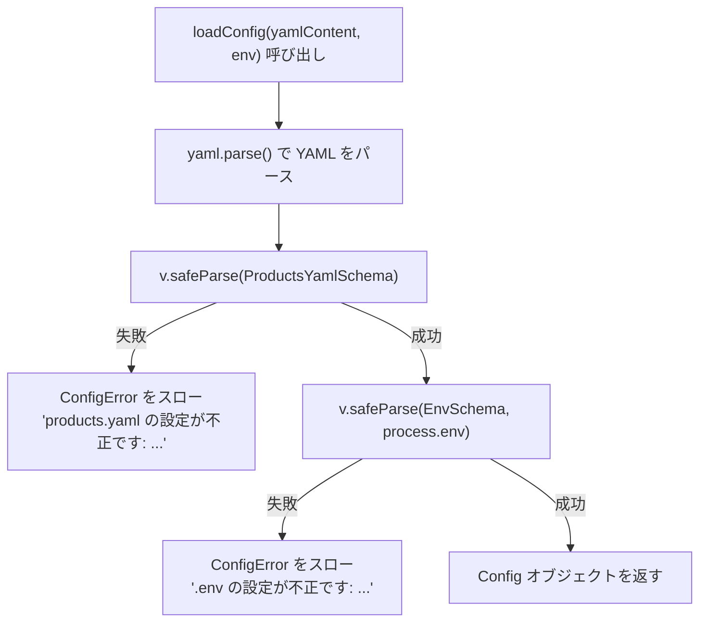

# 設定リファレンス

stock-alert の設定は **2 つのファイル**で管理します。

| ファイル | 役割 |
|---|---|
| `products.yaml` | 監視する商品リスト（URL・サイト種別） |
| `.env` | 資格情報・実行間隔（機密情報を含むため git 管理外） |

---

## products.yaml

### スキーマ

```yaml
products:
  - name: string        # 商品名（通知メッセージに使用）
    url: string         # 商品ページの URL
    siteType: rakuten | yodobashi | nintendo
```

### 記述例

```yaml
products:
  - name: Nintendo Switch 2
    url: https://books.rakuten.co.jp/rb/18162834/
    siteType: rakuten

  - name: Nintendo Switch 2
    url: https://www.yodobashi.com/product/100000001007954538/
    siteType: yodobashi

  - name: Nintendo Switch 2
    url: https://store.nintendo.co.jp/item/HAC-S-KAAAA.html
    siteType: nintendo
```

> 同一商品を複数サイトで登録することができます。それぞれ独立して状態管理されます。

### URL の形式

各サイトには URL から識別子を抽出するルールがあります。

| siteType | 抽出する識別子 | URL のパターン | 例 |
|---|---|---|---|
| `rakuten` | ISBN | `/rb/(\d+)/` | `https://books.rakuten.co.jp/rb/4088843819/` |
| `yodobashi` | 商品コード | `/product/(\d+)` | `https://www.yodobashi.com/product/100000001007954538/` |
| `nintendo` | 抽出なし | URL をそのまま使用 | `https://store.nintendo.co.jp/item/HAC-S-KAAAA.html` |

---

## 環境変数 (.env)

`.env.example` をコピーして `.env` を作成してください。

```bash
cp .env.example .env
```

### 変数一覧

| 変数名 | 必須 | デフォルト | 説明 |
|---|---|---|---|
| `SLACK_WEBHOOK_URL` | ✅ | — | Slack Incoming Webhook の URL |
| `RAKUTEN_APP_ID` | ✅ | — | 楽天 API のアプリケーション ID |
| `CHECK_INTERVAL_SECONDS` | — | `300` | 在庫チェックの間隔（秒） |

#### SLACK_WEBHOOK_URL

[Slack の Incoming Webhooks](https://api.slack.com/messaging/webhooks) で発行した URL を設定します。Bot Token は使用しません。

```
SLACK_WEBHOOK_URL=<Slack Incoming Webhooks で発行した URL>
```

#### RAKUTEN_APP_ID

[楽天デベロッパー](https://webservice.rakuten.co.jp/) で発行したアプリ ID を設定します。`siteType: rakuten` の商品がない場合でも必須です（起動時に検証されます）。

```
RAKUTEN_APP_ID=1234567890123456789
```

#### CHECK_INTERVAL_SECONDS

在庫チェックの実行間隔を秒で指定します。Playwright を使用する商品が多い場合は、1 ティックの実行時間（商品数 × 最大 35 秒程度）を考慮して余裕を持たせてください。

```
CHECK_INTERVAL_SECONDS=300
```

---

## 設定の検証フロー

起動時に `src/config.ts` の `loadConfig` が YAML と環境変数の両方を valibot で検証します。



`ConfigError` は `src/index.ts` で捕捉され、エラーメッセージを標準エラー出力に表示して `process.exit(1)` で終了します。valibot の issue 情報が JSON 形式で含まれるため、どのフィールドが不正かを確認できます。
